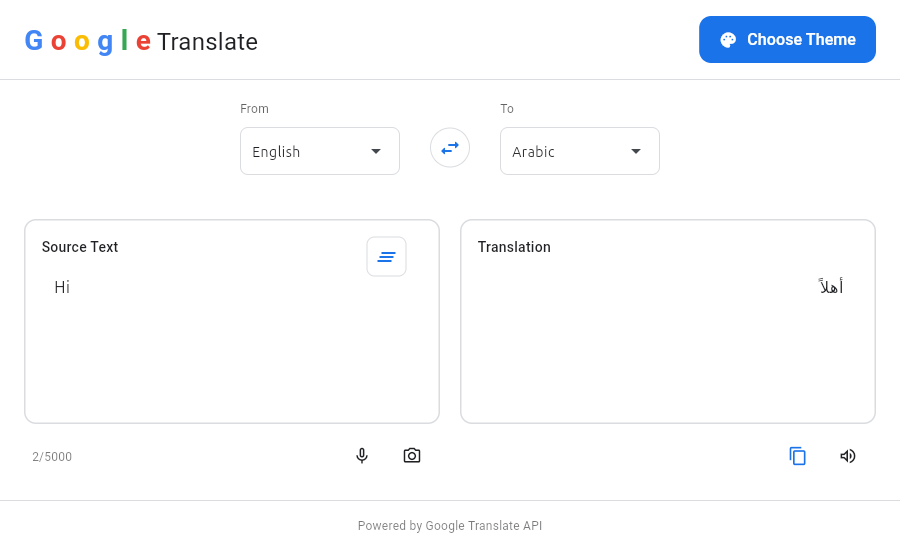
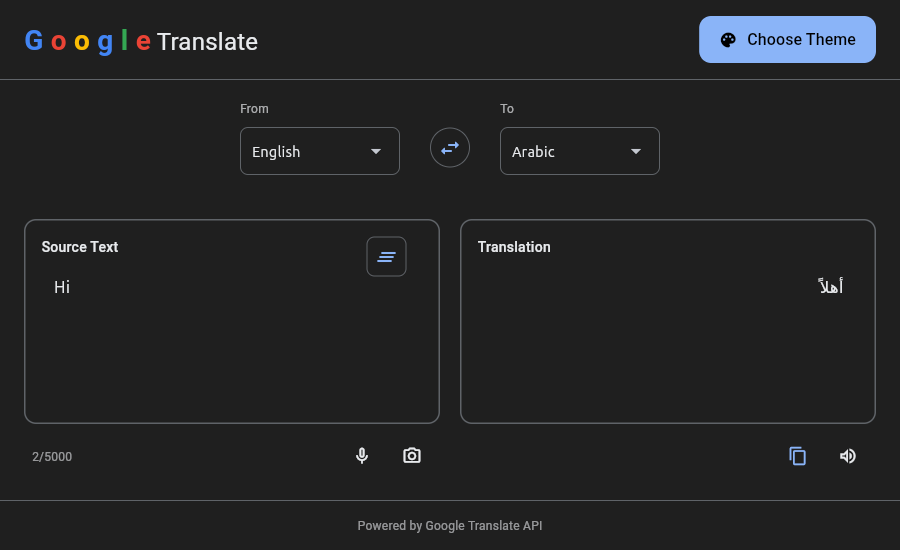

# TransLingua Desktop

<!--  -->

A sophisticated desktop translation companion that brings the power of Google Translate to your fingertips with multiple input methods and a beautiful, intuitive interface.

---

| Theme | Screenshot |
|-------|------------|
| **Light Mode** |  |
| **Dark Mode** |  |

---

## 🚀 Quick Start

### **Manual Setup & Installation**
```bash
# Clone the repository
git clone https://github.com/osamalzabidi/TransLingua.git
cd TransLingua

# Install dependencies
poetry install .

# Run the application
python3 main.py
```

<!--
### **Latest Version:** `v1.0.0`
**Release Date:** November 27, 2025
**Python:** 3.12+
**Platform:** Windows, macOS, Linux
-->

---

## 🌟 Features

### **Core Translation**
- ✅ **Text Translation** – Real-time text translation
- ✅ **Multiple Languages** – 100+ languages
- ✅ **Auto Language Detection**
- ✅ **Language Swap**
- ✅ **Copy Translation**

### **Translation Methods**
- ✅ **Text Translation**

### **UI/UX**
- ✅ **Modern Google-style UI**
- ✅ **Light/Dark Theme**
- ✅ **Responsive Design**

---

## 📋 Changelog

### **v1.0.0 (Current)**
- ✅ Initial release  
- ✅ All core translation methods  
- ✅ Theme support  
- ✅ 100+ language support  

---

## 📋 TODO / Upcoming Features

### **High Priority**
- 🔲 Pronunciation display
- 🔲 Smarter auto-detect language
- 🔲 Settings Page

### **Settings Page Features**
- 🔲 Proxy configuration
- 🔲 Startup window size
- 🔲 Service URLs
- 🔲 User agent customization
- 🔲 Timeout settings
- 🔲 HTTP/2 toggle
- 🔲 Default languages

### **Helper Methods**
- 🔲 Text cleaning utilities (`_`, and other untranslatable chars)
- 🔲 Translation history

### **Additional Features**
- 🔲 About page
- 🔲 Offline Mode
- 🔲 Keyboard shortcuts
- 🔲 Offline mode
- 🔲 Additional translation engines
- 🔲 Translation memory
- 🔲 Document Translation (PDF, DOC, DOCX, TXT)
- 🔲 Voice Translation (Speech-to-text)
- 🔲 Camera Translation (real-time OCR)
- 🔲 Conversation Mode (bilingual live translation)

---

## 🤝 Contributing
Contributions are welcome!  
Please check the contribution guide.

### **Areas Needing Contribution**
- Voice recognition engine
- Camera OCR
- Offline mode
- Improve UI/UX

---

## 📄 License
This project is licensed under the **GPL-3.0 License**.

---

## 🙏 Acknowledgments
- `flet` UI framework
- `googletrans` library
- All contributors & testers

---

**Note:** This desktop application is for personal use. Please respect Google’s Terms of Service when using their translation services.
